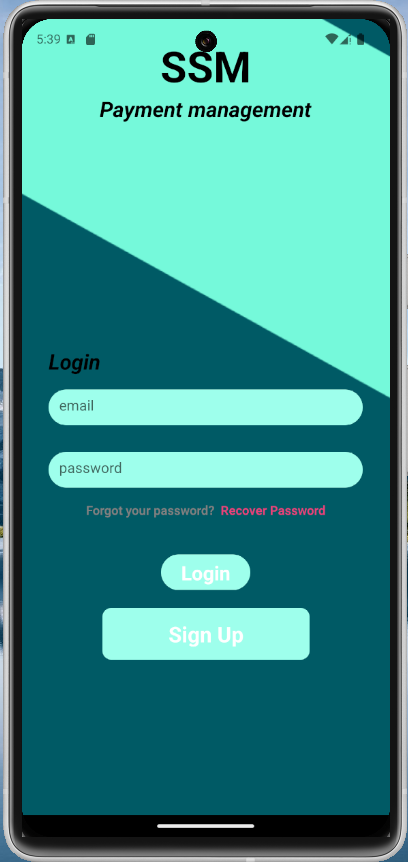
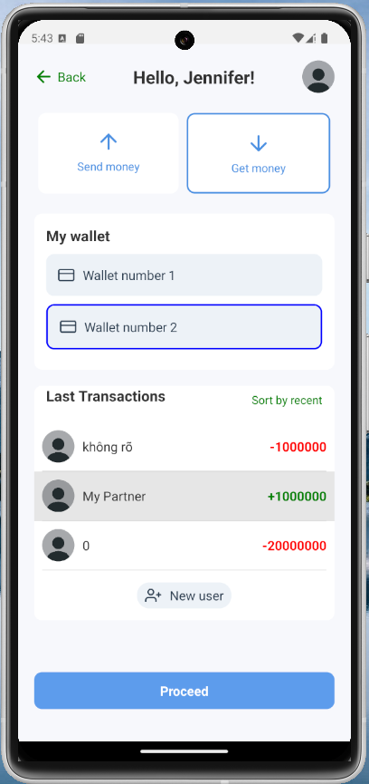
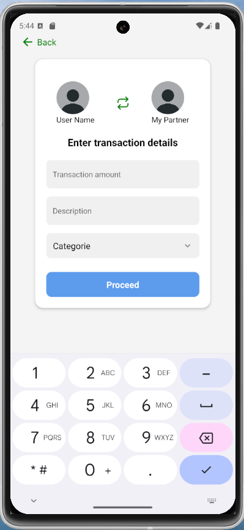
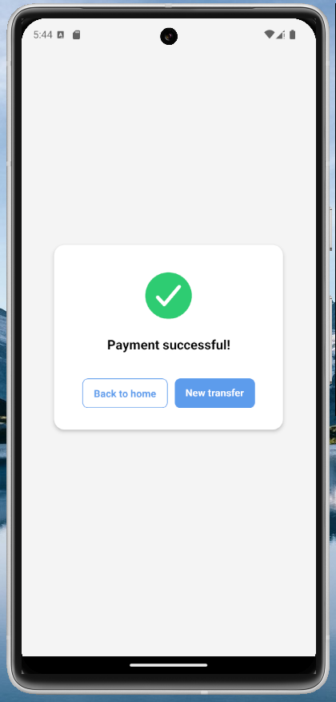
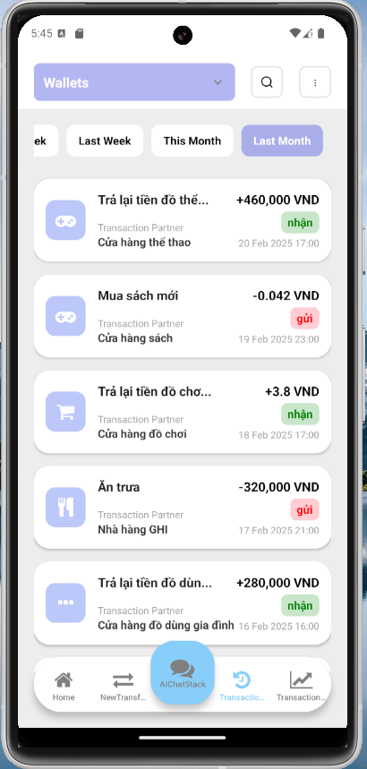
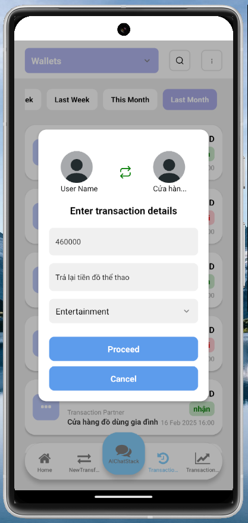
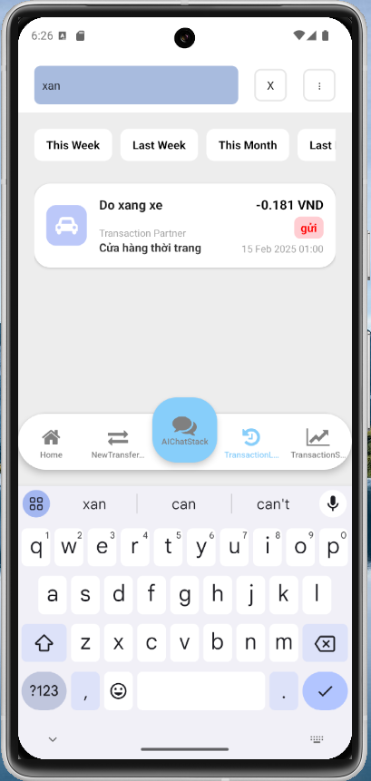
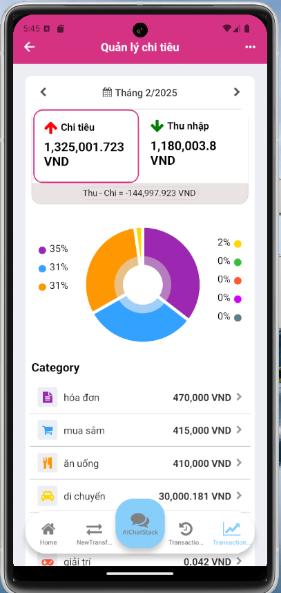
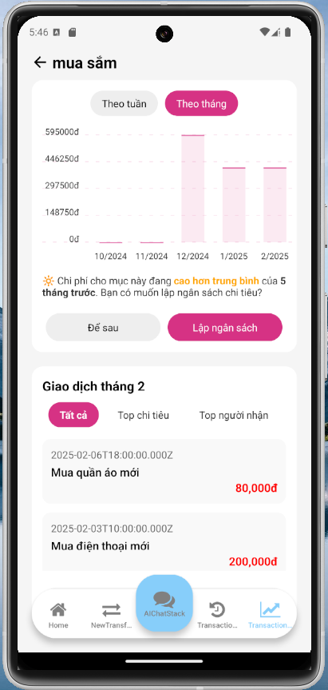
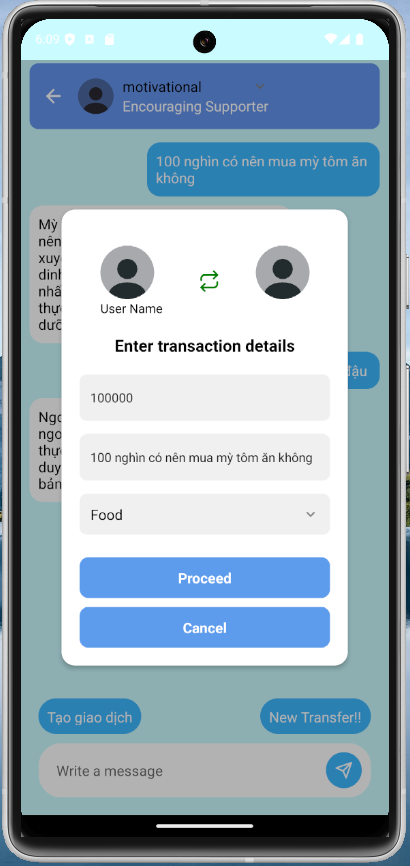

# **Ví Tiền Thông Minh**
## Giới Thiệu

**Ví Tiền Thông Minh** là một ứng dụng di động được thiết kế để hỗ trợ người dùng trong việc quản lý tài chính cá nhân một cách thông minh và hiệu quả. Ứng dụng này tích hợp công nghệ trí tuệ nhân tạo (AI) để cung cấp các tính năng như tạo, chỉnh sửa giao dịch, thống kê và phân tích giao dịch.

### Tính năng chính

- **Quản lý giao dịch**: Lưu trữ và hiển thị lịch sử giao dịch chi tiết, bao gồm thu chi.
- **Phân tích tài chính**: Sử dụng AI để phân tích dữ liệu và đưa ra các khuyến nghị về quản lý tài chính.
- **Tư vấn hỏi đáp**: AI hỗ trợ trả lời các câu hỏi liên quan đến quản lý tài chính.
- **Tích hợp AI**: Tích hợp AI để đưa ra quyết định tài chính thông minh hơn.

## Demo

  <video src="https://github.com/HoangAnhEm/AIChatBot_Frontend/demo/demo.mp4" controls="controls" style="max-width: 730px;">
</video>

## Công nghệ sử dụng

- **Frontend**: Phát triển giao diện người dùng bằng **React Native**.
- **Backend**: Sử dụng **Node.js** với framework **S.js** và cơ sở dữ liệu **MongoDB**.
---

## Hướng Dẫn Sử Dụng

1. **Tạo tài khoản**:
   - Nhập thông tin email, tên, và mật khẩu.
   - Xác nhận tài khoản qua email.
    

  
  
  

2. **Tạo và chỉnh sửa giao dịch**:
   - Mở giao diện chính để thêm giao dịch mới.
   - Ghi nhận thời gian và chi tiết giao dịch.

  
  
  

3. **Truy vấn lịch sử**:
   - Xem và sắp xếp các báo cáo tài chính theo ngày hoặc loại giao dịch.

  
  
  

3. **Phân tích tài chính**:
   - Xem và phân tích các báo cáo tài chính theo loại và loại giao dịch.

  
  

4. **Tư vấn hỏi đáp**:
   - Sử dụng tính năng hỏi đáp để nhận tư vấn từ AI.

  
  
  
  

## Cảm ơn
Cảm ơn bạn đã sử dụng **Ví Tiền Thông Minh**. Chúng tôi hy vọng ứng dụng sẽ giúp bạn quản lý tài chính một cách hiệu quả hơn.
